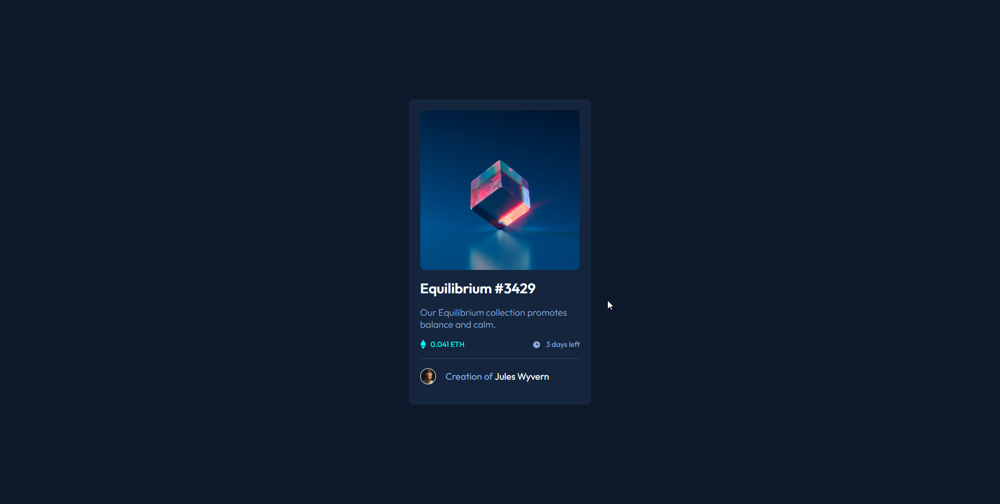

# Frontend Mentor - NFT preview card component solution

This is a solution to the [NFT preview card component challenge on Frontend Mentor](https://www.frontendmentor.io/challenges/nft-preview-card-component-SbdUL_w0U). Frontend Mentor challenges help you improve your coding skills by building realistic projects. 

## Table of contents

- [Overview](#overview)
  - [The challenge](#the-challenge)
  - [Screenshot](#screenshot)
  - [Links](#links)
- [My process](#my-process)
  - [Built with](#built-with)
  - [What I learned](#what-i-learned)
  - [Continued development](#continued-development)
  - [Useful resources](#useful-resources)
- [Author](#author)

## Overview

### The challenge

### Screenshot



### Links
- Solution URL: [URL](https://abelgmz.github.io/frontend-mentor/nft-preview-card/)

## My process

### Built with
- Semantic HTML5 markup
- CSS custom properties/font
- Flexbox
- Scss

### What I learned

```css Create overlay effect over img
.overlay {
    position: absolute;
    @extend %flexbox;
    justify-content: center;
    align-items: center;
    top: 0;
    left: 0;
    width: 100%;
    height: 100%;
    opacity: 0;
    cursor: pointer;
    transition: all .3s ease;
    border-radius: .5rem;
    background-color: rgba(0, 255, 247, .5);
    &:hover {
        opacity: 1;
    }
}
```

### Continued development
- HTML 5 semantic markup
- Css effects
- Flexbox
- Scss


### Useful resources
- [Video 1 - overlay effect](https://www.youtube.com/watch?v=exb2ab72Xhs&ab_channel=dcode) - This helped me to create the overlay effect over an image.

## Author
- [Linkedin](https://www.linkedin.com/in/abelardo-gomez-rodriguez-bb1912246/)

